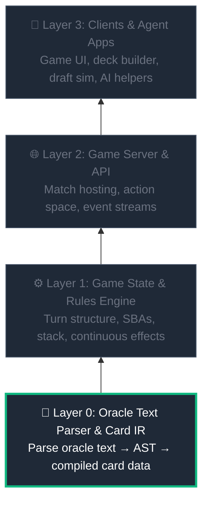

# MTG Ecosystem (Project Multiverse)

Project Multiverse is an initiative to digitize Magic: The Gathering into a modular, layered, agent-first system — built from the bottom up.

## 🌟 Vision

1. **The Game is the API**: Every layer exposes clean, documented interfaces.
2. **AI is a First-Class Citizen**: Agents can consume card data, query rules, and play games natively.
3. **Bottom-Up Construction**: Each layer is fully tested and documented before the next one begins.

## 🏗️ Layered Architecture & Build Order



**Current focus → Layer 0**: The Oracle Text Parser.

## 📂 Project Structure

The project is structured as a **TypeScript monorepo** using **npm workspaces**:

```
mtg-ecosystem/
├── README.md                           # Project overview, quickstart, roadmap
├── CONTRIBUTING.md                     # How to set up, contribute, and submit PRs
├── LICENSE                             # Project license
├── .gitignore                          # Git ignore rules
│
├── docs/                               # Project-wide documentation
│   ├── architecture.md                 # System architecture & layer overview
│   ├── oracle_parser.md                # Parser design, AST, and IR format
│   ├── data_schemas.md                 # Input and output JSON schemas
│   ├── agent_design.md                 # Agent-first integration philosophy
│   ├── decisions.md                    # Architectural decision log with rationale
│   ├── glossary.md                     # MTG & system terminology reference
│   ├── project-structure.md            # Directory structure and workspaces guide
│   └── scryfall-integration.md         # Scryfall bulk data ingestion pipeline
│
└── packages/                           # Monorepo packages (npm workspaces)
    ├── oracle-parser/                  # Layer 0: ANTLR grammar + TypeScript parser
    ├── card-data/                      # Compiled Card IR (output of oracle-parser)
    ├── game-engine/                    # Layer 1: Rules engine (future)
    └── game-server/                    # Layer 2: Game server & API (future)
```

For a detailed explanation of each directory and config file, see the [Project Structure Guide](docs/project-structure.md).

## 🚀 Running the Pipeline

To set up, ingest Scryfall data, compile the parser, and run validation:

1. **Install Dependencies**:
   ```bash
   npm install
   ```
2. **Download Scryfall Bulk Data**:
   ```bash
   npm run ingest
   ```
   *(Downloads and caches the 165MB `oracle_cards` export locally under `.scryfall-cache/oracle-cards.json`)*
3. **Compile the Parser**:
   ```bash
   npm run generate-parser
   ```
   *(Requires Java JDK. Compiles modular `.g4` rules under `packages/oracle-parser/grammar/` into TypeScript)*
4. **Execute Parser Validation**:
   ```bash
   npm run validate
   ```
   *(Deduplicates, parses, and logs success rate and categorized syntax errors for all 33,000+ cards)*
5. **Run Vitest Suite**:
   ```bash
   npm test
   ```

## 📚 Documentation

| Document | Description |
|----------|-------------|
| [Architecture](docs/architecture.md) | System-wide layered architecture and build order |
| [Oracle Parser](docs/oracle_parser.md) | **Layer 0** — Parser design, pipeline, AST spec, and IR format |
| [Data Schemas](docs/data_schemas.md) | Standardized JSON schemas for Card IR, decks, and game state |
| [Agent Design](docs/agent_design.md) | Agent-first integration patterns and AI assistant vision |
| [Decisions Log](docs/decisions.md) | Architectural decision record (ANTLR → TS, per-set JSON, etc.) |
| [Glossary](docs/glossary.md) | Reference mapping MTG jargon to system concepts |
| [Project Structure](docs/project-structure.md) | Detailed walkthrough of repository directories and workspaces |
| [Scryfall Integration](docs/scryfall-integration.md) | Ingestion and normalization pipeline for Scryfall bulk data |
| [Contributing Guide](CONTRIBUTING.md) | How to set up, build, test, and contribute to the ecosystem |

## 🗺️ Roadmap

- [ ] **Milestone 1 — Oracle Text Parser**: Parse card oracle text into a typed AST, compile to an intermediate representation (IR), and store as card data files. Well-tested, well-documented, extensible for new sets.
- [ ] **Milestone 2 — Game State Engine**: Deterministic rules engine consuming compiled card IR. Turn structure, stack, SBAs, priority, continuous effects.
- [ ] **Milestone 3 — Game Server & API**: Network layer exposing matches, action spaces, and event streams.
- [ ] **Milestone 4 — Ecosystem Clients**: Game UI, deck builder, draft simulator, and AI agent applications.
