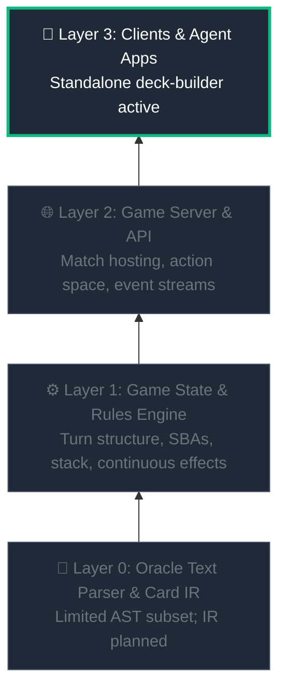

# MTG Ecosystem (Project Multiverse)

Project Multiverse is an initiative to digitize Magic: The Gathering into a modular, layered, agent-first system — built from the bottom up.

## 🌟 Vision

1. **The Game is the API**: Every layer exposes clean, documented interfaces.
2. **AI is a First-Class Citizen**: Agents can consume card data, query rules, and play games natively.
3. **Bottom-Up Architecture**: Layers have explicit contracts; the active standalone deck-builder is an intentional exception to the original build order.

## 🏗️ Layered Architecture & Build Order


```mermaid
graph BT
    classDef current fill:#1f2937,stroke:#10b981,stroke-width:3px,color:#fff;
    classDef future fill:#1f2937,stroke:#475569,stroke-width:1px,color:#6b7280;

    L0["🔮 Layer 0: Oracle Text Parser & Card IR<br/>Limited AST subset; IR planned"]:::future
    L1["⚙️ Layer 1: Game State & Rules Engine<br/>Turn structure, SBAs, stack, continuous effects"]:::future
    L2["🌐 Layer 2: Game Server & API<br/>Match hosting, action space, event streams"]:::future
    L3["📱 Layer 3: Clients & Agent Apps<br/>Standalone deck-builder active"]:::current

    L0 --> L1
    L1 --> L2
    L2 --> L3
```

**Current focus → deck-builder**, a standalone Layer-3 application. The Layer-0 parser is a limited supported subset; the rules engine, game server, and Card IR emitter remain future work. Read the relevant package’s `AGENTS.md` before development.

## 📂 Project Structure

The project is structured as a **TypeScript monorepo** using **npm workspaces**:

```
mtg-ecosystem/
├── README.md                           # Project overview, quickstart, roadmap
├── CONTRIBUTING.md                     # How to set up, contribute, and submit PRs
├── LICENSE                             # Project license
├── .gitignore                          # Git ignore rules
│
├── docs/                               # Project-wide documentation
│   ├── architecture.md                 # System architecture & layer overview
│   ├── oracle_parser.md                # Parser design, AST, and IR format
│   ├── data_schemas.md                 # Input and output JSON schemas
│   ├── agent_design.md                 # Agent-first integration philosophy
│   ├── decisions.md                    # Architectural decision log with rationale
│   ├── glossary.md                     # MTG & system terminology reference
│   ├── project-structure.md            # Directory structure and workspaces guide
│   └── scryfall-integration.md         # Scryfall bulk data ingestion pipeline
│
└── packages/                           # Monorepo packages (npm workspaces)
    ├── oracle-parser/                  # Layer 0: hand-written TypeScript parser
    ├── deck-builder/                   # Active standalone deck application
    ├── card-data/                      # Compiled Card IR (output of oracle-parser)
    ├── game-engine/                    # Layer 1: Rules engine (future)
    └── game-server/                    # Layer 2: Game server & API (future)
```

For a detailed explanation of each directory and config file, see the [Project Structure Guide](docs/project-structure.md).

## 🚀 Running the Pipeline

The parser uses Node ≥ 23 and has no Java or parser-generation step.
From the repository root:

```bash
npm install
npm run check --workspace=@mtg-ecosystem/oracle-parser
npm run ingest
npm run validate
```

`check` runs TypeScript checking and Node's structural test suite, including
pipeline tests. `ingest` validates and atomically caches `oracle_cards` under
`.scryfall-cache/`. `validate` reports acceptance with corpus/source identities
and explicit exclusions. Use `npm run validate -- --json` for a machine-readable
report. Acceptance is not semantic correctness; fixing false successes can
lower coverage. `npm run build-ir` intentionally fails because emission is not
implemented.

For deck-builder setup, use its [package manual](packages/deck-builder/AGENTS.md).

## 📚 Documentation

| Document | Description |
|----------|-------------|
| [Architecture](docs/architecture.md) | System-wide layered architecture and build order |
| [Oracle Parser](docs/oracle_parser.md) | **Layer 0** — Parser design, pipeline, AST spec, and IR format |
| [Data Schemas](docs/data_schemas.md) | Implemented AST contract and proposed Card IR envelope |
| [Agent Design](docs/agent_design.md) | Agent-first integration patterns and AI assistant vision |
| [Decisions Log](docs/decisions.md) | Current decisions and superseded historical proposals |
| [Glossary](docs/glossary.md) | Reference mapping MTG jargon to system concepts |
| [Project Structure](docs/project-structure.md) | Detailed walkthrough of repository directories and workspaces |
| [Scryfall Integration](docs/scryfall-integration.md) | Ingestion and normalization pipeline for Scryfall bulk data |
| [Contributing Guide](CONTRIBUTING.md) | How to set up, build, test, and contribute to the ecosystem |

## 🗺️ Roadmap

- [ ] **Milestone 1 — Oracle Text Parser**: Parse card oracle text into a typed AST, compile to an intermediate representation (IR), and store as card data files. Well-tested, well-documented, extensible for new sets.
- [ ] **Milestone 2 — Game State Engine**: Deterministic rules engine consuming compiled card IR. Turn structure, stack, SBAs, priority, continuous effects.
- [ ] **Milestone 3 — Game Server & API**: Network layer exposing matches, action spaces, and event streams.
- [ ] **Milestone 4 — Ecosystem Clients**: Game UI, deck builder, draft simulator, and AI agent applications.
