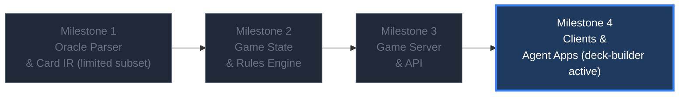

# System Architecture

This document describes the full layered architecture of the MTG Ecosystem. The intended dependency order is **bottom-up**. The standalone deck-builder was pulled forward and is the active package; it does not depend on the parser or rules engine. The parser remains a limited supported subset, with broader work paused.

---

## 🗺️ Build Order

---

## 💾 Layer 0: Oracle Text Parser & Card IR

**Goal**: Parse every MTG card's oracle text into a typed AST, then compile it into per-set JSON IR files that downstream layers consume.

**Key components**:
- **Ingestion**: Pull raw card data from Scryfall bulk data.
- **Normalizer and lexer**: Preserve ability boundaries and tokenize text without dropping unknown characters.
- **Hand-written parser**: Builds typed AST nodes directly from supported productions.
- **AST contract**: `packages/oracle-parser/src/ast.ts`; explicit logic, event grouping, zones, restrictions, and scope.
- **Verification**: Structural and negative tests, cursor invariants, and reproducible corpus acceptance reports.
- **Semantic validation and IR emitter** (future): Resolve references, check consumer capabilities, and emit versioned per-set artifacts under `packages/card-data/sets/`.

**Stack**: Zero-runtime-dependency TypeScript, executed directly by Node ≥ 23.
`npm run build-ir` fails explicitly; parsed ASTs are not yet executable Card IR.

See **[Oracle Parser Design](oracle_parser.md)** for full details.

---

## ⚙️ Layer 1: Game State & Rules Engine

**Goal**: A deterministic state machine that takes a `GameState` + `Action` → produces a new `GameState` + `Events`. Consumes the compiled Card IR from Layer 0.

**Key subsystems** (future):
1. **Turn & Phase State Machine**: Track phases, steps, priority passes, and turn order.
2. **Stack & Resolution**: LIFO stack for spells and abilities, including targeting and resolution.
3. **MTG Layer System (Rule 613)**: Evaluate continuous effects in the correct dependency order.
4. **State-Based Actions**: Check-loop for lethal damage, legend rule, 0 toughness, etc.
5. **Triggered Ability Controller**: Detect and order triggers (APNAP).
6. **Dynamic Rule Registry**: Track replacement effects, restrictions, and modifications.

---

## 🌐 Layer 2: Game Server & API

**Goal**: Expose the rules engine over a network API for multiplayer matches, replays, and agent integration.

**Key components** (future):
- Real-time event streams (WebSocket or gRPC).
- Semantic action space API — clients query legal actions, not guess.
- State diffs for efficient syncing.
- Explanation API for rules tracing.

---

## 📱 Layer 3: Ecosystem Applications

**Goal**: Client-side software built on top of the API layer.

**Applications**:
- **Game Client**: Board visualization, player input, animations.
- **Deck Builder** (active, standalone): Uses its own Scryfall SQLite database. Future integration must not delay its current development.
- **Draft Simulator**: Booster drafting against AI or humans.
- **AI Agents**: Play assistants, rules advisors, and playtesting bots.
