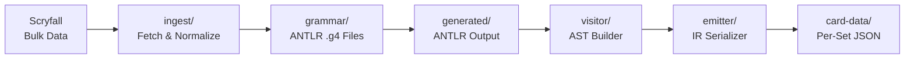
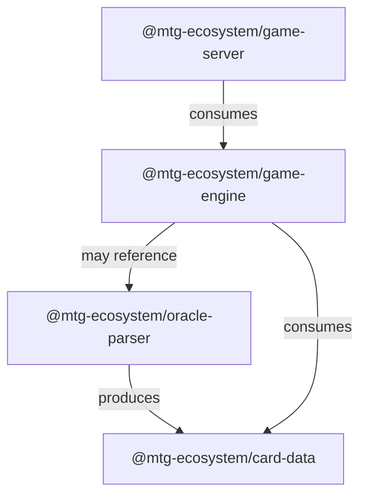

# Project Structure

This document explains the directory layout of the MTG Ecosystem monorepo, what each component contains, and how the pieces connect.

> [!NOTE]
> The project is in early development. Directories marked **(future)** are planned but not yet created. The current focus is **Layer 0: Oracle Text Parser**.

---

## Overview

The MTG Ecosystem is a **TypeScript monorepo** managed with **npm workspaces**. Each major system component lives in its own package under `packages/`, with shared configuration and documentation at the root.

```
mtg-ecosystem/
├── README.md                           # Project overview, quickstart, roadmap
├── CONTRIBUTING.md                     # How to set up, contribute, and submit PRs
├── LICENSE                             # Project license
├── .gitignore                          # Git ignore rules
├── package.json                        # Root workspace config (npm workspaces)
├── tsconfig.base.json                  # Shared TypeScript configuration
│
├── docs/                               # Project-wide documentation
│   ├── architecture.md                 # System architecture & layer overview
│   ├── oracle-parser.md                # Parser design: pipeline, AST, IR format
│   ├── data-schemas.md                 # Scryfall input schemas & Card IR output schema
│   ├── agent-design.md                 # Agent-first integration philosophy (vision)
│   ├── decisions.md                    # Architectural decision log with rationale
│   ├── glossary.md                     # MTG & system terminology reference
│   ├── project-structure.md            # This document
│   └── scryfall-integration.md         # Scryfall data ingestion pipeline
│
├── packages/                           # Monorepo packages (npm workspaces)
│   │
│   ├── oracle-parser/                  # Layer 0: ANTLR grammar + TypeScript parser
│   │   ├── README.md                   # Package-level docs: API, usage, examples
│   │   ├── package.json
│   │   ├── tsconfig.json
│   │   ├── grammar/                    # ANTLR grammar definitions
│   │   │   ├── MTGLexer.g4             # Lexer rules (tokens)
│   │   │   └── MTGParser.g4            # Parser rules (structure)
│   │   ├── src/
│   │   │   ├── index.ts                # Public API entry point
│   │   │   ├── ast/                    # TypeScript AST node type definitions
│   │   │   │   ├── types.ts            # Discriminated union types for all AST nodes
│   │   │   │   └── index.ts
│   │   │   ├── visitor/                # ANTLR parse tree → AST visitor
│   │   │   │   ├── ASTBuilder.ts       # Main visitor that builds typed AST
│   │   │   │   └── index.ts
│   │   │   ├── ingest/                 # Scryfall data ingestion & normalization
│   │   │   │   ├── scryfall.ts         # Fetch & normalize Scryfall bulk data
│   │   │   │   ├── normalize.ts        # Strip reminder text, normalize oracle text
│   │   │   │   └── index.ts
│   │   │   └── emitter/                # AST → JSON IR serializer
│   │   │       ├── ir-emitter.ts       # Serialize AST to per-set JSON
│   │   │       └── index.ts
│   │   ├── generated/                  # ANTLR-generated TypeScript (gitignored)
│   │   └── tests/
│   │       ├── snapshots/              # Snapshot test fixtures
│   │       ├── parser.test.ts          # Parser unit tests
│   │       └── coverage.test.ts        # Mechanic coverage tracking
│   │
│   ├── card-data/                      # Compiled Card IR (output of oracle-parser)
│   │   ├── README.md
│   │   ├── package.json
│   │   └── sets/                       # Per-set JSON IR files
│   │       ├── LEA.json
│   │       ├── MH3.json
│   │       └── ...
│   │
│   ├── game-engine/                    # Layer 1: Rules engine (future)
│   ├── game-server/                    # Layer 2: Game server & API (future)
│   └── ... (future packages)
│
└── scripts/                            # Build & development scripts
    ├── generate-parser.sh              # Run ANTLR to generate TypeScript parser
    ├── ingest-scryfall.ts              # Download & cache Scryfall bulk data
    └── build-ir.ts                     # Run full pipeline: ingest → parse → emit IR
```

---

## Root Files

| File | Purpose |
|------|---------|
| `package.json` | Defines npm workspaces, shared dev dependencies (TypeScript, ANTLR tooling, test runner), and root-level scripts. |
| `tsconfig.base.json` | Shared TypeScript compiler options inherited by all packages via `"extends"`. Enforces strict mode, consistent module resolution, and path aliases. |
| `CONTRIBUTING.md` | Contributor guide — prerequisites, setup, workflow, PR process. |
| `.gitignore` | Ignores `node_modules/`, `dist/`, ANTLR `generated/` output, and OS artifacts. |

### Root `package.json` (planned)

```jsonc
{
  "name": "mtg-ecosystem",
  "private": true,
  "workspaces": [
    "packages/*"
  ],
  "scripts": {
    "build": "npm run build --workspaces",
    "test": "npm run test --workspaces",
    "generate-parser": "bash scripts/generate-parser.sh",
    "ingest": "npx ts-node scripts/ingest-scryfall.ts",
    "build-ir": "npx ts-node scripts/build-ir.ts"
  },
  "devDependencies": {
    "typescript": "^5.x",
    "vitest": "^3.x",
    "antlr4": "^4.x"
  }
}
```

---

## `docs/` — Project Documentation

All project-wide documentation lives here. Package-specific docs (API reference, usage examples) belong in the package's own `README.md`.

| Document | Description |
|----------|-------------|
| [architecture.md](architecture.md) | Layered system architecture and build order |
| [oracle-parser.md](oracle_parser.md) | Parser pipeline design, AST node taxonomy, IR format |
| [data-schemas.md](data_schemas.md) | JSON schemas for Card IR, Deck, and Game State |
| [agent-design.md](agent_design.md) | Agent-first integration patterns and AI use cases |
| [decisions.md](decisions.md) | Architectural decision log with full pros/cons analysis |
| [glossary.md](glossary.md) | MTG and system terminology reference |
| [project-structure.md](project-structure.md) | This document |
| scryfall-integration.md | Scryfall data ingestion pipeline *(planned)* |

### Naming Convention

Documentation files use **kebab-case** (e.g., `project-structure.md`). Some existing files use underscores (e.g., `oracle_parser.md`) — these will be normalized over time.

---

## `packages/` — Monorepo Packages

Each subdirectory under `packages/` is an independent npm package with its own `package.json`, `tsconfig.json`, and test suite. Packages are connected via npm workspaces — they can import each other by name without manual linking.

### `packages/oracle-parser/` — Layer 0: The Parser

The heart of the current milestone. This package contains everything needed to go from raw Scryfall card data to compiled JSON IR.



| Directory | Purpose | Key Files |
|-----------|---------|-----------|
| `grammar/` | ANTLR grammar definitions — the formal spec of MTG's card language. This is the single source of truth for what the parser can handle. | `MTGLexer.g4`, `MTGParser.g4` |
| `src/ast/` | TypeScript type definitions for all AST nodes. Uses discriminated unions for type-safe node handling. | `types.ts` |
| `src/visitor/` | The ANTLR visitor that walks the generated parse tree and produces typed AST nodes. This is where grammar rules become application logic. | `ASTBuilder.ts` |
| `src/ingest/` | Scryfall data fetching and normalization. Strips reminder text, handles multi-face cards, and prepares oracle text for parsing. | `scryfall.ts`, `normalize.ts` |
| `src/emitter/` | Serializes the AST into versioned, per-set JSON IR files. Handles deterministic output ordering for clean diffs. | `ir-emitter.ts` |
| `generated/` | ANTLR-generated TypeScript code (lexer, parser, visitor base classes). **Auto-generated and gitignored** — regenerate with `npm run generate-parser`. | *(auto-generated)* |
| `tests/` | Unit tests, snapshot tests, and mechanic coverage tracking. | `parser.test.ts`, `coverage.test.ts` |

#### Why separate `grammar/` from `src/`?

The grammar is a **language specification**, not application code. Keeping it separate makes it easy to:
- Review grammar changes independently
- Generate parsers for multiple target languages (Python, etc.) from the same `.g4` files
- Use ANTLR IDE tooling (railroad diagrams, grammar debugging) without navigating source code

#### Why separate `ast/` from `visitor/`?

The AST types are a **public API contract** — downstream packages and the rules engine depend on these types. The visitor is an internal implementation detail of how those types get constructed from a parse tree. Separating them allows the AST types to be imported without pulling in ANTLR dependencies.

### `packages/card-data/` — Compiled Card IR

The output of the oracle-parser pipeline. Contains the per-set JSON IR files that downstream layers consume.

| Directory | Purpose |
|-----------|---------|
| `sets/` | One JSON file per MTG set (e.g., `LEA.json`, `MH3.json`). Each file contains all compiled card data for that set. ~350 files when fully populated. |

This package has a dependency on `oracle-parser` (it is *produced by* the parser pipeline), but downstream consumers only need to depend on `card-data` — they don't need the parser itself.

```jsonc
// packages/card-data/package.json
{
  "name": "@mtg-ecosystem/card-data",
  "version": "0.1.0",
  "main": "sets/",
  "files": ["sets/"]
}
```

### `packages/game-engine/` — Layer 1: Rules Engine *(future)*

Will consume `card-data` to implement the full MTG rules engine: turn structure, stack resolution, state-based actions, the layer system (Rule 613), priority, and triggered/activated ability management.

### `packages/game-server/` — Layer 2: Game Server *(future)*

Network layer exposing the rules engine over WebSocket/gRPC for multiplayer matches, replays, spectating, and agent integration.

---

## `scripts/` — Build & Development Scripts

Root-level scripts for project-wide operations. These are run from the repository root.

| Script | Purpose | Usage |
|--------|---------|-------|
| `generate-parser.sh` | Runs the ANTLR tool (requires Java) to regenerate the TypeScript lexer/parser from `.g4` grammar files into `packages/oracle-parser/generated/`. | `npm run generate-parser` |
| `ingest-scryfall.ts` | Downloads and caches the latest Scryfall bulk data export. Stores the raw JSON locally to avoid repeated API calls. | `npm run ingest` |
| `build-ir.ts` | Runs the full pipeline: ingest Scryfall data → parse oracle text → emit per-set JSON IR to `packages/card-data/sets/`. | `npm run build-ir` |

---

## How npm Workspaces Connect Packages

npm workspaces allow packages to reference each other by name. Dependencies between packages are declared in each package's `package.json`:



To add a workspace dependency:

```bash
# From repository root
npm install @mtg-ecosystem/card-data --workspace=packages/game-engine
```

This creates a symlink in `node_modules/` — no publishing or manual linking required. All packages share the same `node_modules/` tree at the root.

---

## Naming Conventions

| Element | Convention | Examples |
|---------|-----------|----------|
| Packages | `@mtg-ecosystem/<name>` (scoped) | `@mtg-ecosystem/oracle-parser` |
| Directories | kebab-case | `oracle-parser/`, `card-data/` |
| TypeScript files | camelCase or kebab-case | `ASTBuilder.ts`, `ir-emitter.ts` |
| AST type names | PascalCase | `TriggeredAbility`, `DealDamage` |
| Grammar files | PascalCase with MTG prefix | `MTGLexer.g4`, `MTGParser.g4` |
| IR set files | UPPERCASE set code | `LEA.json`, `MH3.json`, `DSK.json` |
| Test files | `*.test.ts` | `parser.test.ts` |
| Docs | kebab-case markdown | `project-structure.md` |

---

## `.gitignore` Considerations

The following should be gitignored:

```gitignore
# Dependencies
node_modules/

# Build output
dist/
*.js.map

# ANTLR generated code (regenerate with npm run generate-parser)
packages/oracle-parser/generated/

# Scryfall bulk data cache (large, re-downloadable)
.scryfall-cache/

# OS artifacts
.DS_Store
Thumbs.db

# IDE
.idea/
.vscode/
```

> [!IMPORTANT]
> The `generated/` directory under `oracle-parser` is gitignored because it contains auto-generated code that can be reproduced from the `.g4` grammar files. Always regenerate after cloning: `npm run generate-parser`.

---

*See also: [Architecture](architecture.md) · [Oracle Parser](oracle_parser.md) · [Contributing](../CONTRIBUTING.md) · [Glossary](glossary.md)*
